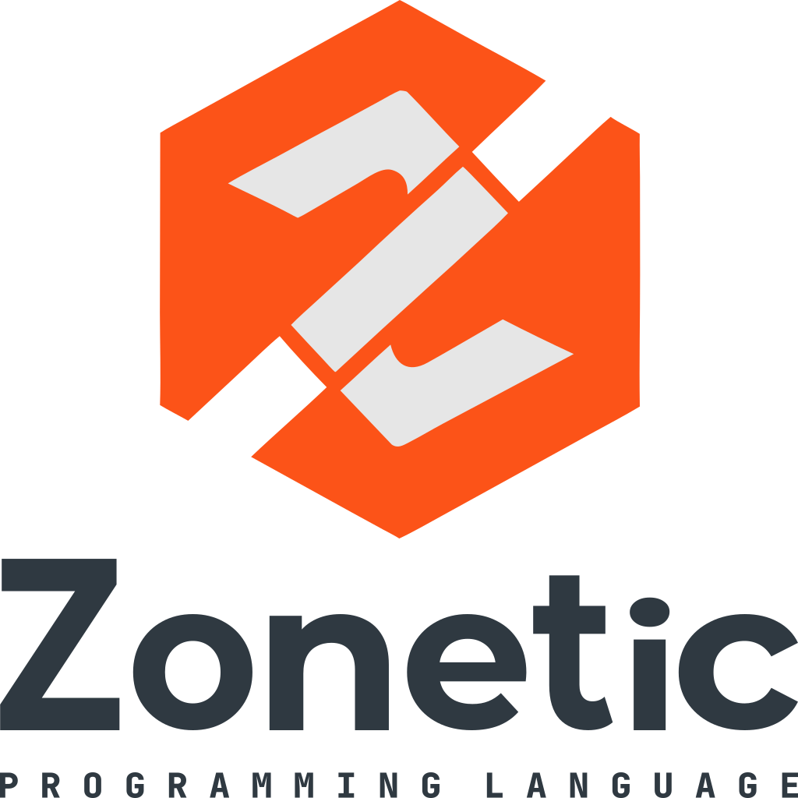

<picture>
  <source media="(prefers-color-scheme: dark)" srcset="./assets/icons/logo_zonetic_dark.svg">
  
</picture>

# Zonetic Programming Language

A statically typed, expression-oriented language designed for robotics.

## Status
> Currently in active development — refactor phase.
> Parser and semantic analysis complete. Bytecode VM in progress.

## Features
- Explicit mutability with `mut` / `inmut`
- Form-based control flow (`if`, `while`, `infinity`)
- Block expressions with `give`
- Rust-inspired error reporting with spans
- Hybrid statement terminators (`;` or newline)

## Quick Look
```rust
mut counter: int = 0

while counter < 10 {
    counter += 1
    if counter == 5 {
        break
    }
}
```

## Documentation
See [`docs/`](docs/) for full language documentation.